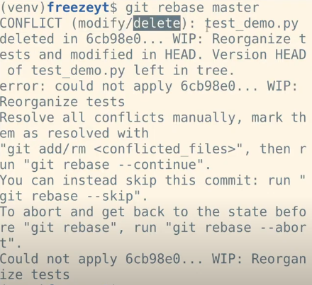
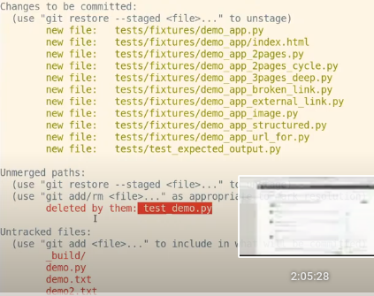
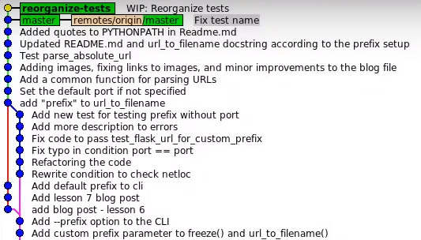
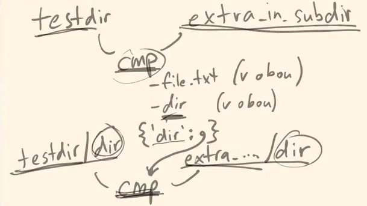
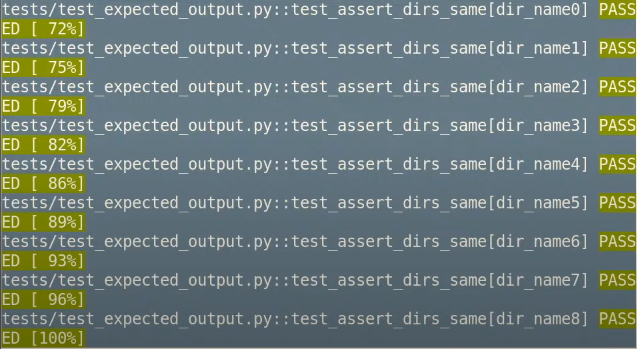

# Tests Reorganization and Parametrization

**[9th Online Meeting](https://www.youtube.com/watch?v=JQMvylmLs2Q&list=PLFt-PM7J_H3EU5Oez3ZSVjY5pZJttP2lT&index=10&t=0s&ab_channel=encukou), August 31, 2020**

***Mentor: Petr Viktorin***

### Checking New PRs
- Blog 6, change some images into code snippets.
- Test_parse_absolute_url, add tests for netloc, port and path.

*00hr:18mins*

Petr started to reorganize tests on a separate branch because it was not to be done in one shot. In order not to lose the work done he commited it as WIP (work in progress) without pushing it.
To continue working on it he switched to the ```reorganize tests``` branch.

### Rebase the reorganize-tests branch to the master in order not to lose any history.

Each commit in Git represents the state of the whole project. ```Git show``` and ```gitk --all``` both display all the changes since the last commit. In the background however it actually saves the whole content/state of each commit. Saving the whole state of all commits makes it possible for Git to display all that happened within each commit. In reality, it compares the state of the previous/parent commit, and the state of the current commit by listing the ```diff --git a/``` of all files from both commits.

To do the ```git rebase master```, Git takes the diff or all changes from the commit and attempts to apply the same changes to the current master. More precisely, Git creates a new commit, goes file by file and tries to apply all changes until a conflict appears or until all changes are applied to the master.


### Good Rebase - Conflict Example
*00hr:21min*



The "modify/delete" means that ```test_demo.py``` changed in the master and the same file was deleted from the reorganize-tests branch which is being rebased.



"Version HEAD of test_demo.py left in tree" means that the file ```test_demo.py``` was left in the working tree although it was deleted/renamed into ```test_expected_output.py``` in the reorganize-tests branch. This change was done because test_demo.py contained repetitive tests which import an app, freeze the same and than check if the app does what it was supposed to do.

***Future Issue:***
*00hr:24min*

The new tests do not assert ```test_flask_url_for_custom_prefix_without_port(tmp_path)```.

After all conflicts are resolved and the changes are commited just ```git rebase --continue``` to complete the rebase. Finally, reorganize-tests is established on the master branch.



### Add test_expected_output comparing freeze output to expected output
*00hr:27min*
```python
import importlib
from freezeyt import freeze

def test_output(tmp_path, module name='demo app'):
    module = importlib.import_module(module_name) #naimportuje si applikace ze importlib
    app = module.app

    freeze(app, tmp_path)

    expected = Path(__file__).parent / 'fixtures' / module_name

    print(expected)

    cmp = filecmp.dircmp(tmp_path, expected, ignore=[]) #comparison

    assert False
```
At this point this test freezes an app from the demo_app module. Creates a variable ```expected``` (the path to the fixtures folder) in order to be able to compare it's content to the actual output of the freeze. We used [filecmp](https://docs.python.org/3/library/filecmp.html) to make the comparison between what we froze and what is in the expected fixtures folder. Next it is needed to create the asserts for this test.

```python
print(cmp.left_only) #files found only in the left folder (in this case tmp_path)
print(cmp.right_only) #files found only in the right folder (in this case expected)
print(cmp.diff_files)
print(cmp.common_funny) #in case the same thing is a file on one side and a folder or smth. else on the other side
print(cmp.subdirs) #comparison of dictionaries {directory : content}
print(cmp.diff_files) #different files on each side
```

It is better to create an [assert_dirs_same](https://github.com/encukou/freezeyt/blob/0bbed56c3cc49f06451d0b89fb8537761403b976/tests/test_expected_output.py#L34-L37) function which will do the comparison.

### Testing the Test - Comparing Directory Trees
*00hr:38min*

Created folders ```same``` and ```testdir```, inside the fixtures folder. ```testdir``` contains a file.txt with some random text, and a sub-folder with a file inside it. Inside the fixtures folder is a ```dirs_same``` folder containing all possible variations of testing folders which should cause the test to fail like ```missing_file```, ```extra_file```, ```extra_in_subdir```, ```missing_dir```, ```missing_file_in_dir```, ```same```, ```funny```, ```diff_files```.


At this stage ```test_assert_dirs_same``` compares all these possible variations to both ```testdir``` and ```same``` since these two need to be identical for the tests to pass:
```python
def test_assert_dirs_same():
  fixture_path = Path(__file__).parent / 'fixtures' 'dirs_same'before_reorganize_tests.png
  for path in fixture_path.iterdir():
    if path.name in ('testdir', 'same'):
      assert_dirs_same(path, fixture_path / 'testdir')
    else:
      with pytest.raises(AssertionError):
        assert_dirs_same(path, fixture_path / 'testdir')
```

Everytime ```test_assert_dirs_same``` fails we solve each failure and build the ```assert_dirs_same``` gradually. The first one that failed was funny so the appropriate assertion was added to ```assert_dirs_same```:
```python
if cmp.common_funny:
  raise AssertionError(f'Funny dofferemces: {cmp.common_funny}')
```

The same is done until all ```test_assert_dirs_same``` conditions pass without a failure.  

### Testing Subdirectories - Calling a Function From Another Function
*00hr:54min*

The test does not count on subdirectories so we need to find a way for each ```subdir``` to pass the ```test_assert_dirs_same``` as well. The best way to do this is to divide ```assert_dirs_same``` in two functions where one will be calling the other.



In this case, ```cmp``` notes all files and folders that are within each folder using ```filecmp.dircmp``` and does the same again for each subfolder every time [```assert_dirs_same``` calls ```assert_cmp_same](https://github.com/encukou/freezeyt/blob/0bbed56c3cc49f06451d0b89fb85before_reorganize_tests.png37761403b976/tests/test_expected_output.py#L34%20-%20L60).

### Future ISSUE
*01hr:09min*

Improve the description to AssertionErrors in [assert_cmp_same](https://github.com/encukou/freezeyt/blob/0bbed56c3cc49f06451d0b89fb8537761403b976/tests/test_expected_output.py#L39-L57) gradually as further test failures appear. It would be good to get the absolute path to the folder where the failure happens for example.

When calling assert_dirs_same inside test_output we got an ```AssertionError: Files does not have expected content: ['index.html']```

### Gradually Improving Tests
The following asks pytest to compare the expected and the output file to make it easier to locate the the difference:
```python
if cmp.diff_files:
  for filename in cmp.diff_files:
    path1 = Path(cmp.left) / filename
    path2 = Path(cmp.right) / filename
    assert parh1.read_text() == path2.read_text()
```
This provided the following:


### Interactive Rebase - complete control over the branch's commit history
*01hr:19min*

Interactive rebase was used to merge the work_in_progress commit to reorganize tests. ```$ git rebase --interactive <branch_from_where_to_start>```

This way you get a list of a few commands to change your commits history:


Reword lets you change the description of a commit and we squashed (melded) the two commits into one.

### Making sure no commits were lost - changing commit history
*01hr:25min*

```
$ git --reflog
```
Shows the entire and complete history of commits which existed at any point in time, and makes it possible to retrieve lost commits:


This history can be browsed using the commit name: ``` $ git show HEAD @ {3}``` - where the history was three changes ago, or ``` $ git show HEAD@{3.weeks.ago}```. This way you can return to any of the changes at any point in he commit history. Also available ```$ git log HEAD@{3.weeks.ago}``` and ```$ gitk --all HEAD@{3.weeks.ago}```

### Make sure something is running in a special mode in order to generate the already corrected output (directly copied from the frozen output)
*01hr:33min*

What we did so far compares the current frozen output to the expected output and we are supposed to fix the differences manually. We want the corrected output to be generated by a special mode. When we run the tests in this special mode the expected output is created on its own. How to ensure that tests are running in a special mode? How to pass some information to a running application?

**Two ways**

1. Create a switch ``` $ python -m pytest -vv --create-data```. This switch triggers pytest to create the test data/expected output

2. ``` $ export TEST_CREATE_EXPECTED_OUTPUT=1 ```, and than check if this environmental variable is not already set in the test. If yes, no need to compare, just copy the content of the frozen into the expected using a special module [shutil](https://docs.python.org/2/library/shutil.html#shutil.copytree):

        ```python
        if 'TEST_CREATE_EXPECTED_OUTPUT' in os.environ:
          shutil.copytree(tmp_path, expected)
        ```

From this point on, when adding a new tests we have to run them from 'TEST_CREATE_EXPECTED_OUTPUT' and afterwards check if the generated files contain the expected output.

### Parameterized tests - run the same test function over and over again using different values.
*01hr:47min*

So far the tests run on one app only, and to test the rest of the demo_apps we could use the for cycle used in the ```test_assert_dirs_same()```. However ***using a loop has a disadvantage in because it breaks a the first exception***.
This is why @pytest.mark.parametrize: parametrizing test functions was used.

### Making two tests out of one function
*01hr:50min*

The function takes the ```dir_names``` argument, add it to the path, and than use ```@pytest.mark.parametrize('dir_names', ['difference', 'extra'])``` setting the ```dir_names``` argument to 'difference' and 'extra'. Making two tests out of a single function. More precisely, a single test function receives and tests two different parameters, 'difference' and 'extra'.

[test_assert_dirs_same](https://github.com/encukou/freezeyt/blob/0bbed56c3cc49f06451d0b89fb8537761403b976/tests/test_expected_output.py#L63-L74) was changed accordingly, the fixture_path was made into a global variable named DIRS_SAME_FIXTURES and than we are able to iterate over it inside the test, which made it possible to test all of the apps from inside fixtures with this single test:



### Homework
- Write doc strings (what it does and how to call it) to new test functions or comments (how it does it)
- [Issue#32](https://github.com/encukou/freezeyt/issues/32)before_reorganize_tests.png
- hledani odkazy ve CSS very complicated
- [Issue#39](https://github.com/encukou/freezeyt/issues/39), Petr will do it live
- doc. string for freeze
- Add to readme - what the prefix means
- create blog app.
- write tests for parse_absolute_url [issue#45](https://github.com/encukou/freezeyt/issues/45) test the rest of the attributes, port and hostname.
- New [issue#50](https://github.com/encukou/freezeyt/issues/50), Parametrize test_expected_output.test_output
